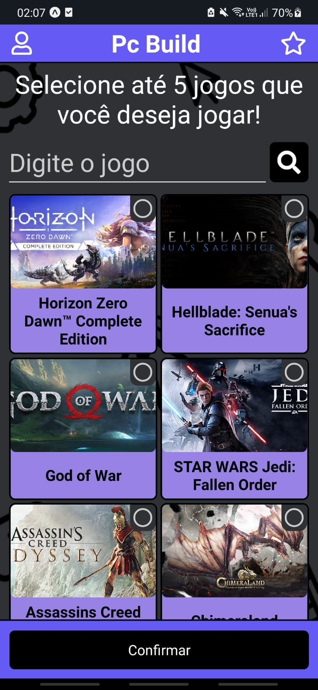
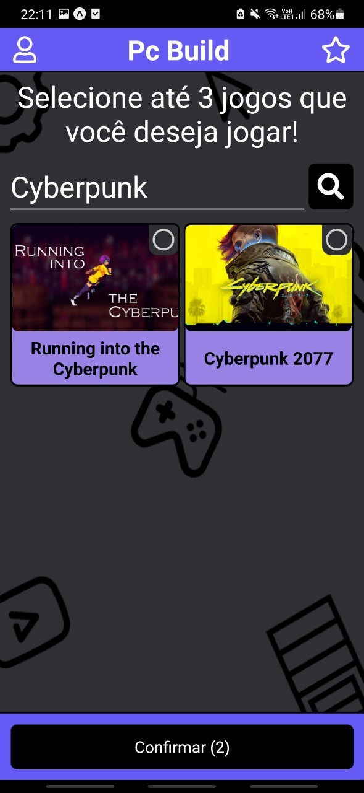
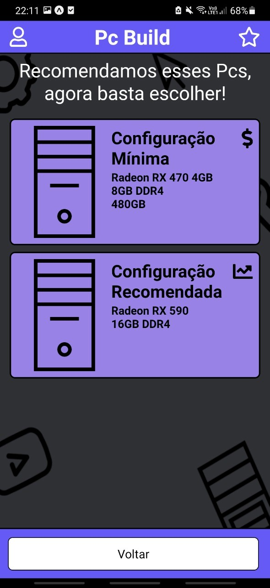

<h1>PC Build</h1>

Este projeto tem como intuito auxiliar na escolha de peças de computador, se baseando na necessidade do usuario, sendo assim, as peças são calculadas através da escolha dos jogos (e futuramente aplicativos/áreas de trabalho).

Abaixo segue algumas das telas do projeto:

  
  
  
  

